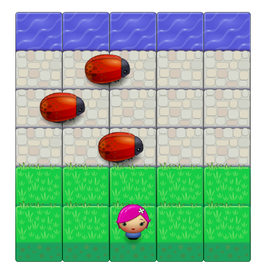

# Arcade Game 

This is a classic arcade game. The game board consists of a player and 3 enemies (bugs). The goal is to reach the water, without colliding into any of the enemies. 

The project created interactive objects/classes and instances using **ES6 Object-Oriented JavaScript**.  




## Table of Contents

* [Installation](#installation) 
* [Built With](#built-with)
* [How to Play](#how-to-play)
* [Authors](#authors)
* [Acknowledgments](#acknowledgments)

## Installation 

To install the arcade game locally, clone the Github repository: 
```
$ git clone https://github.com/deboragaleano/arcade-game.git
```
To preview the `index.html` (using the GitHub & BitBucket HTML Preview) please click here: [Arcade Game](https://htmlpreview.github.io/?https://github.com/deboragaleano/arcade-game/blob/master/index.html).

## Built With

* ES6 JavaScript - Object-Oriented 
* HTML and CSS


## How To Play 

* In this game you have a Player and Enemies (Bugs). 
* The goal of the player is to reach the water, without colliding into any of the enemies. 
* The player can move left, right, up and down using arrow keys on the keyboard. 
* The enemies move in varying speeds. If the player collides with an enemy, the game is reset and the player moves back to the start square. 
* Once the player reaches the water the game is won.

## Authors

* **Udacity** - This repository included a starter code (visual assets and a game loop engine) for all Udacity students. 
* **Debora Galeano** - Object-oriented features; classes and methods.  

## Acknowledgments

* Collision functionality: [Stack Overflow](https://stackoverflow.com/questions/13916966/adding-collision-detection-to-images-drawn-on-canvas). 
* Udacity [Webinar](https://www.youtube.com/watch?v=oz7pHJ65TEk&feature=youtu.be): For helping with object dimensions & getting started 
* Richard Codes: for the [modal popup](https://www.youtube.com/watch?v=gLWIYk0Sd38) reference. 


